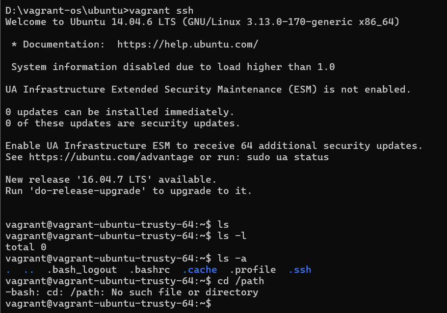

# Using Vagrant Cloud for Virtual Ubuntu

Vagrant Cloud is a platform that allows users to discover, share, and manage Vagrant boxes. It simplifies provisioning virtual environments using providers like VirtualBox, VMware, and others. Below are the detailed steps to set up and use Vagrant Cloud to create a virtual Ubuntu environment.

## Prerequisites
1. **Install VirtualBox** (if not installed already) - [Download Here](https://www.virtualbox.org/)
2. **Install Vagrant** - [Download Here](https://www.vagrantup.com/downloads)
3. **Create a HashiCorp Account** for Vagrant Cloud - [Sign Up Here](https://portal.cloud.hashicorp.com/sign-up)
4. **Install Git** (Optional, for version control) - [Download Here](https://git-scm.com/downloads)

## How to Identify Official Vagrant Boxes
Official Vagrant boxes are provided by trusted sources such as **Canonical** (for Ubuntu) or **Amazon** (for AWS images). To check if a box is official:
1. **Search on Vagrant Cloud**: Visit [Vagrant Cloud](https://app.vagrantup.com/) and look for boxes verified with an official provider badge.
2. **Use the `vagrant cloud search` Command**: Run the following command to search for official Ubuntu boxes:
   ```sh
   vagrant cloud search ubuntu
   ```
3. **Check the Provider**: Official boxes often have a **verified publisher** like `ubuntu/focal64` (Canonical) or `hashicorp/bionic64` (HashiCorp maintained boxes).
4. **Read the Documentation**: Each official box has details on its provider page, including release versions and supported configurations.

## Step-by-Step Guide

### 1. Verify Installation
After installation, confirm that VirtualBox and Vagrant are installed correctly:
```sh
vagrant --version
virtualbox --help
VBoxManage --help
```
If installed correctly, these commands should return their respective versions.

### 2. Initialize a New Vagrant Project
Create a directory for your Vagrant project and navigate to it:
```sh
mkdir vagrant-os
cd vagrant-os
```
Initialize a new Vagrant environment using an official Ubuntu base box:
```sh
vagrant init ubuntu/focal64
```
This creates a `Vagrantfile`, which defines the VM configuration.

### 3. Start the Virtual Machine
Run the following command to start the VM:
```sh
vagrant up
```
This command will:
- Download the `ubuntu/focal64` box if not already available.
- Start the virtual machine.

### 4. SSH into the Virtual Machine
Once the VM is up, access it using:
```sh
vagrant ssh
```
Now you are inside the virtual Ubuntu machine.


### 5. Manage the VM
- **Suspend the VM** (Saves the current state):
  ```sh
  vagrant suspend
  ```
- **Halt the VM** (Shuts it down):
  ```sh
  vagrant halt
  ```
- **Destroy the VM** (Deletes the VM permanently):
  ```sh
  vagrant destroy
  ```

### 6. Share the Box on Vagrant Cloud
To share your custom Vagrant box on Vagrant Cloud:
1. **Login to Vagrant Cloud**
   ```sh
   vagrant cloud auth login
   ```
   Enter your credentials when prompted.

2. **Package the VM**
   ```sh
   vagrant package --output my-box.box
   ```

3. **Create a New Box on Vagrant Cloud**
   Go to [Vagrant Cloud](https://app.vagrantup.com/) and create a new box.

4. **Upload the Box**
   ```sh
   vagrant cloud publish YOUR_USERNAME/ubuntu-box version provider --box my-box.box --release
   ```
   Example:
   ```sh
   vagrant cloud publish myuser/ubuntu-box 1.0 virtualbox --box my-box.box --release
   ```

### 7. Use the Custom Box
Once uploaded, anyone can use it by running:
```sh
vagrant init YOUR_USERNAME/ubuntu-box
vagrant up
```

## Conclusion
Vagrant Cloud simplifies virtual machine management and sharing. By ensuring you use **official Vagrant boxes**, you avoid security risks and ensure compatibility with your provider. Using these steps, you can create, configure, and distribute Ubuntu VMs efficiently. This setup is beneficial for DevOps, software development, and testing environments.

