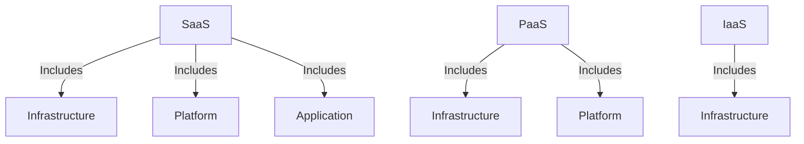
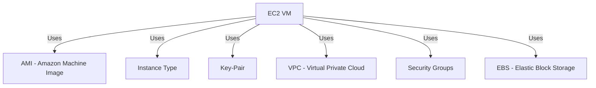

# AWS - Cloud Computing

## Infrastructure
- Resources required to run a project or company.
- Examples: Machines, Network, Storage, Database, Monitoring, etc.

## Types of Infrastructure
1. **On-Premises Infrastructure**
   - Requires purchasing and maintaining all resources.
   - **Challenges:**
     - High cost → High maintenance cost.
     - Scalability issues.
     - Security issues.
     - Network issues.
2. **Cloud Infrastructure**
   - Solves the problems associated with on-prem infrastructure.
   - Uses the **Pay As You Go** model.

## Cloud Computing
- The process of delivering IT resources over the internet on an on-demand basis.

### Advantages
- **Lower cost** compared to on-premises (Pay As You Go model).
- **Scalability** (can scale up easily as it is internet-based).
- **High security**.
- **Backup options** available.

## Cloud Providers
- **AWS** → Amazon
- **Azure** → Microsoft
- **GCP** → Google
- Oracle
- Alibaba
- Salesforce

## Cloud Service Models
1. **IAAS** → Infrastructure as a Service
2. **PAAS** → Platform as a Service
3. **SAAS** → Software as a Service

### SaaS - Software as a Service
- The cloud provider gives an application to run businesses.
- **Examples:** Zoom, Google Drive, Dropbox, Teams, etc.

### Cloud Service Model Overview

### PaaS - Platform as a Service
- The provider offers a ready-made platform to run applications.
- The user takes care of the app, while the provider manages infrastructure and platform.
- **Example:** AWS Elastic Beanstalk.

### IaaS - Infrastructure as a Service
- The provider offers only infrastructure.
- **Examples:** Machines, network, storage.

## AWS Overview
- **Amazon Web Services (AWS)** was launched in **2006**.
- AWS spans **114 availability zones** across **36 geographic regions**, with **12 more planned**.
- Works on a **Pay As You Go** model.
- **Recommended to select the nearest region** for creating infrastructure.
- **AWS provides free-tier accounts** (some services are free) for learning and exploration.

### AWS Services (200+ Services)
1. **EC2**: Elastic Compute Cloud - To create virtual machines (hourly basis).
2. **EBS**: Storage (Hard Disk, SSD - up to 16 TB).
3. **Load Balancer**: Distributes load.
4. **Autoscaling**: Adjusts capacity based on demand.
5. **S3**: Unlimited storage (files).
6. **RDS**: Relational Database Service.
7. **EFS**: Elastic File System.
8. **IAM**: Identity and Access Management.
9. **VPC**: Virtual Private Cloud (Networking - IP, Subnets, Route Tables, NAT, VPN, etc.).
10. **CloudFormation**: Infrastructure as Code (alternative to Terraform).
11. **AWS CLI**: Command Line Interface.
12. **EKS**: Elastic Kubernetes Service (Managed Kubernetes cluster).
13. **Elastic Beanstalk**: Platform as a Service.
14. **AWS Lambda**: Serverless computing.
15. **Route 53**: Domain mapping.
16. **CloudWatch**: Monitoring service.
17. **SNS**: Simple Notification Service (to send alerts).
18. **Billing Overview**.

## EC2 Service
- **Elastic Compute Cloud (EC2)** is one of the most used AWS services.
- Creates **virtual machines** in the AWS cloud.
- **EC2 Instances (VMs)**:
  - AWS provides **t2.micro/t3.micro** free for **1 year** (750 monthly hours).
  - EC2 is **hourly billed**.
  - Example billing:
    - Running from **11:15 AM to 11:30 AM** → 15 mins billed as 1 hour.
    - Running from **11:20 AM to 11:25 AM** → 5 mins billed as 1 hour.
  - **Minimum billing period** is **1 hour**.

### EC2 Storage & Networking
- EC2 instances have **EBS storage**:
  - Windows VM → 30GB (default).
  - Linux VM → 8GB.
  - Maximum EBS capacity → **16TB**.
- **Networking**:
  - **VPC (Virtual Private Cloud)** provides networking.
  - **AMI (Amazon Machine Image)** is used for creating instances.
  - **Security Groups** control traffic.
  - **Key-pair** is used for authentication.
  - **One Key Pair** can be used for multiple instances.

### EC2 Networking Overview

