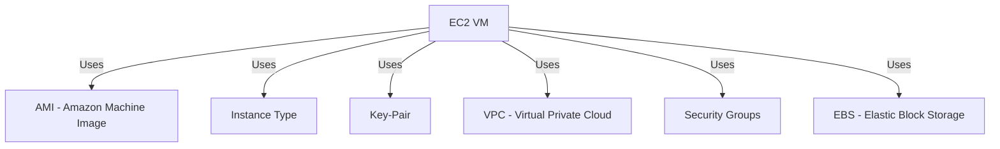
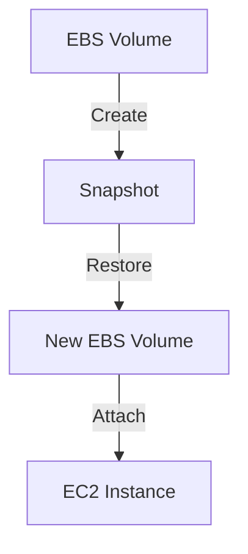

# AWS EC2 & EBS

## EC2 Overview
**Elastic Compute Cloud (EC2)** provides scalable compute capacity in AWS.

### EC2 Components


### Key EC2 Features
- **EBS (Volumes & Snapshots)**
- **IP Addressing**
- **Load Balancer**
- **Static Website Hosting**
- **Auto Scaling**

## Practical Steps on EC2 VM Setup
### 1. Create a Key Pair (.pem file)
- **Public key** (AWS stores it).
- **Private key** (User downloads it).

### 2. Create a Security Group & Update Inbound Rules
- **Allow inbound traffic for:**
  - **Windows RDP**: 3389
  - **Linux SSH**: 22
  - **HTTP**: 80
  - **HTTPS**: 443
  - **MySQL**: 3306

### 3. Create EC2 Instance
- **Select AMI** (Amazon Machine Image).
- **Select Instance Type**.
- **Select Key Pair**.
- **Select Security Groups**.
- **Select EBS Storage**.
- **Launch EC2 instance**.

---
## Types of IPs in AWS
- **Private IP** (Fixed, used for internal communication in VPC).
- **Public IP** (Dynamic, changes when VM restarts, used for external access).
- **Elastic IP** (Fixed public IP, billed if not in use).

### Public & Private IP Examples
```plaintext
Public IPv4: 13.203.198.254 (Open Address)
Private IPv4: 172.31.7.4
Elastic IP: 15.207.146.31
```

### Lab Practicals on Elastic IP
1. **Allocate Elastic IP** from AWS.
2. **Associate Elastic IP** with EC2 VM.
3. **Restart instance & check public IP** (should remain unchanged).
4. **Disassociate Elastic IP** when not needed.
5. **Release Elastic IP to avoid billing**.

---
## EBS - Elastic Block Storage
### Overview
- Block-level storage device (HDD/SSD).
- Attached to EC2 instances.
- Two types of EBS volumes:
  - **Root Volume** (Mandatory, required for instance booting).
  - **Additional Volume** (Optional, can be added/removed).

### Default Storage
- **Windows VM** → 30GB Root Volume.
- **Linux VM** → 8GB Root Volume.
- **Max EBS Volume** → 16TB.

### EBS Volume Types
| Type                 | Min Size | Max Size |
|----------------------|---------|---------|
| General Purpose     | 1 GiB   | 16,384 GiB |
| Provisioned IOPS    | 4 GiB   | 16,384 GiB |
| Cold HDD            | 125 GiB | 16,384 GiB |
| Throughput Optimized| 125 GiB | 16,384 GiB |
| Magnetic            | 1 GiB   | 1,024 GiB |

### EBS & Snapshots


- **Snapshots** are used for backup.
- They are **region-specific**.
- A volume can be created from a snapshot.
- Snapshots cannot be directly attached to EC2.

### Copying Data from One Zone to Another
```plaintext
1. Create a snapshot of the volume in zone 1a.
2. From the snapshot, create a new volume in zone 1b.
3. Attach the new volume to an EC2 instance in zone 1b.
```

---
## Lab Practical: Attaching Additional EBS Volume
### Steps:
1. **Create an EC2 VM** with an 8GB EBS Root volume.
2. **Create an additional volume** (10GB, check AZ).
3. **Attach additional volume** to existing VM.
4. **Connect to VM via SSH**.
5. **Check attached volumes**:
   ```sh
   lsblk
   ```
6. **Format the new volume** (only needed first time):
   ```sh
   sudo mkfs -t ext4 /dev/xvdb
   ```
7. **Create directory & mount volume**:
   ```sh
   mkdir dir1
   sudo mount /dev/xvdb dir1
   ```
8. **Verify mount & create files**:
   ```sh
   cd dir1
   sudo touch file1.txt file2.txt
   ```
9. **Detach additional volume from EC2 VM1**.
10. **Attach volume to a new EC2 VM**.
11. **Verify files in the new VM**:
    ```sh
    lsblk
    ls -l dir1
    ```
12. **Unmount & delete additional volumes after practice to avoid billing**.

---


