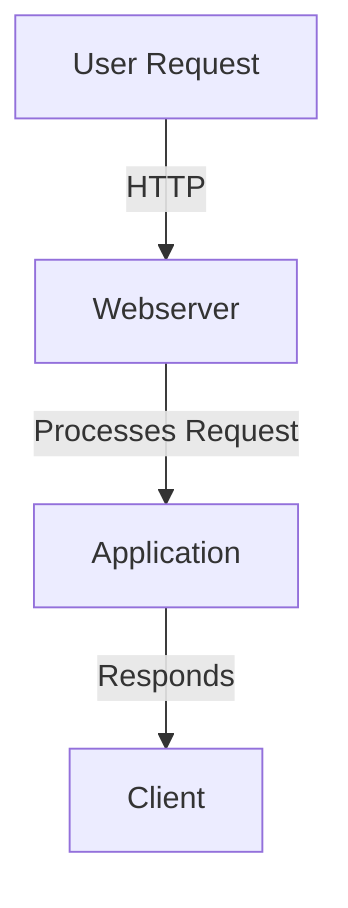
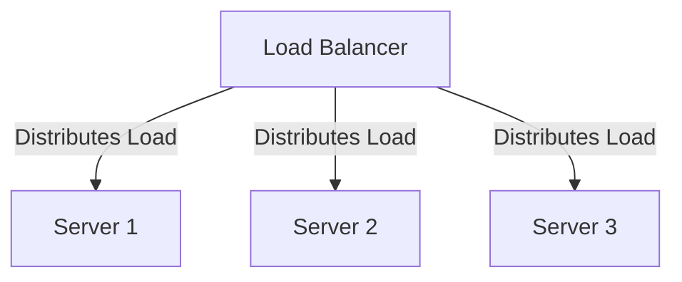
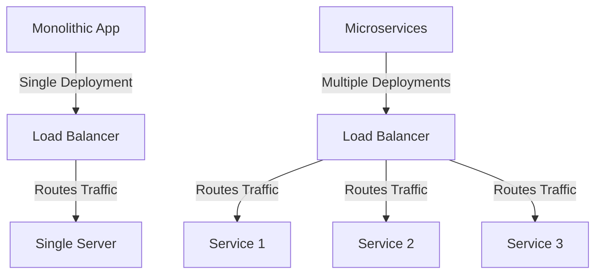
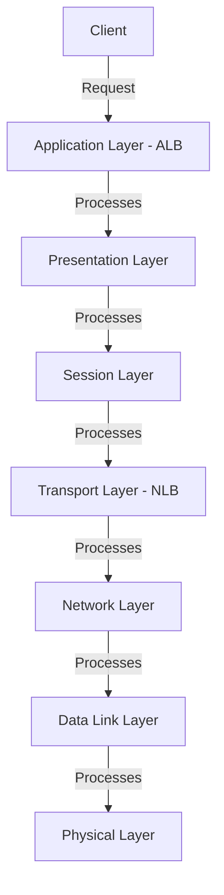
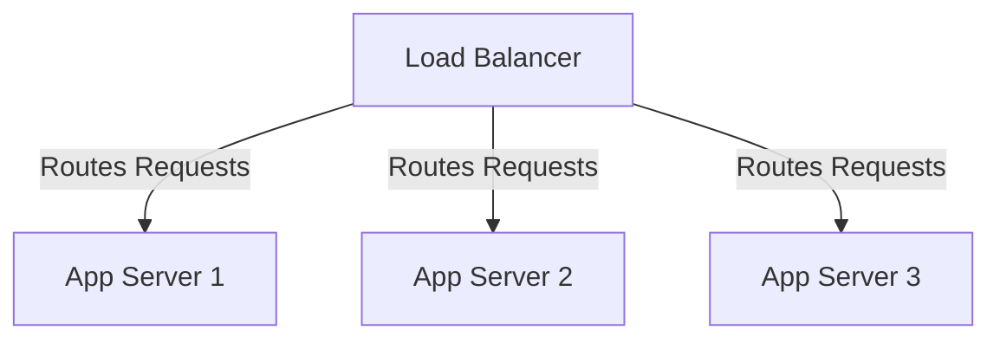

# AWS Load Balancing & Static Website Hosting

## Static Website Hosting

### Website Overview
- A **website** is a collection of web pages (HTML pages).
- **Static Website**: Serves the same response to all users.
- **Dynamic Website**: Generates different responses based on user input.
- A **Webserver** is required to host/run a website.
- Common Webservers:
  - **Static Websites**: Apache, Nginx, httpd.
  - **Dynamic Websites**: Tomcat, IIS.

### Hosting a Website Using HTTPD
#### Installation & Setup
```sh
sudo yum update -y
sudo yum install httpd
sudo systemctl start httpd
```
> **Note:** Enable **HTTP (port 80)** in the Security Group inbound rules.

#### Accessing Website
1. Use the **EC2 instance public IP** to access the website.
2. Modify the website content:
```sh
cd /var/www/html
sudo vi index.html
```
3. Insert:
```html
<h1> bbbbbbb </h1>
```
4. Save and exit, then access the website using the **public IP**.

---
## User Data in EC2 VM
- **User data** is used to execute a script while launching an EC2 instance.
- The script runs only **once** during the first boot.
- Example: Creating an EC2 VM with a user-data script.



### Disadvantages of Single Server Hosting
- A single server handles all incoming requests.
- **High load** → delays in response time.
- **Single Point of Failure** → Server crash leads to downtime.

---
# Load Balancing

### What is Load Balancing?
- A **Load Balancer (LBR)** distributes incoming traffic across multiple servers.
- Uses the **Round Robin** technique for load distribution.

#### Benefits of Load Balancing
- **High Availability**.
- **Scalability**.
- **Improved Performance**.

### Types of Load Balancers in AWS
1. **Application Load Balancer (ALB)** – Works at Layer 7 (HTTP & HTTPS).
2. **Network Load Balancer (NLB)** – Works at Layer 4 (TCP & UDP).
3. **Gateway Load Balancer (GLB)** – Used for advanced networking.

#### Load Balancing Diagram


### Practical Task: Load Balancer Setup
#### Step 1: Create EC2 VM1
```sh
#!/bin/bash
sudo yum install httpd -y
cd /var/www/html
echo "<html> <h1> Telusko Banking App Server -1 </h1> </html>" > index.html
sudo systemctl start httpd
```

#### Step 2: Create EC2 VM2
```sh
#!/bin/bash
sudo yum install httpd -y
cd /var/www/html
echo "<html> <h1> Telusko Banking App Server -2 </h1> </html>" > index.html
sudo systemctl start httpd
```

#### Step 3: Add Instances to Target Group (TG)
- A **Target Group (TG)** is a collection of backend servers.
- Add both **EC2 VM1** and **EC2 VM2** to the Target Group.

---
# Monolithic vs Microservices Architecture

### Monolithic Architecture
- All functionalities are developed in a **single application**.
- Usually requires **one Target Group** for load balancing.

### Microservices Architecture
- Application is divided into multiple **APIs (services)**.
- Each service runs independently and communicates via APIs.
- **Multiple Target Groups** required for different services.



---
## OSI Model & Load Balancing
- **Open Systems Interconnection (OSI) Model** consists of 7 layers.
- Represents **how a request flows** from client to server.

### OSI Model Layers & Load Balancing


- **Application Load Balancer (ALB)** operates at **Layer 7**.
- **Network Load Balancer (NLB)** operates at **Layer 4**.
- **Gateway Load Balancer (GLB)** routes network traffic at **Layer 3**.

---
## Application Load Balancer (ALB)
- Operates at **Layer 7** (Application Layer).
- Routes **HTTP and HTTPS traffic** based on **host/path-based rules**.
- Best suited for:
  - Modern Web Applications.
  - Microservices.
  - Container-based applications.



---
## Scaling and Performance Metrics

### RPM (Requests Per Minute) & Scaling
```plaintext
7 AM  →  40K  →  No Scaling Needed
9 AM  →  80K  →  No Scaling Needed
11 AM →  200K →  Not Enough Capacity
→ Scale the servers to handle 90% of peak load.

12 PM → 250K → No Scaling Needed
2 PM  →  250K → No Scaling Needed
```

- Auto Scaling ensures **servers scale up/down** based on demand.
- Load Balancer distributes traffic **efficiently**.

---