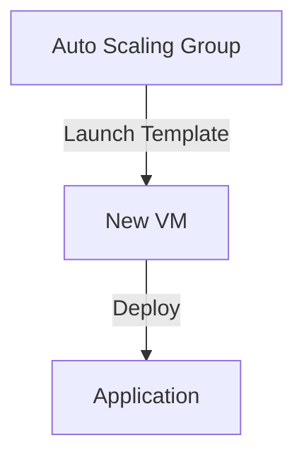
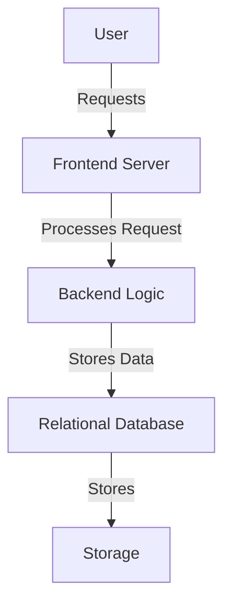
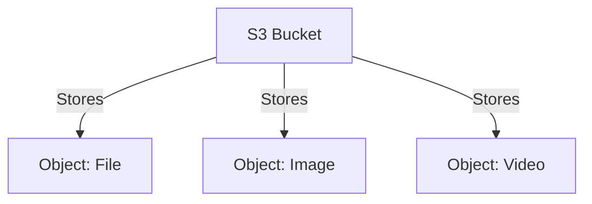

# AWS Auto Scaling, RDS, and S3

## Auto Scaling Groups
- **Auto Scaling** adjusts server capacity to handle traffic efficiently.
- If requests increase, servers scale up. If requests decrease, servers scale down to save costs.

### Benefits of Auto Scaling
1. **Fault Tolerance** - Ensures application remains available.
2. **Cost Management** - Only pay for what you use.
3. **High Availability** - Keeps the app running during peak load.

### Creating an Auto Scaling Group
- **Launch Template**: Defines configuration for launching new EC2 VMs.

### Deploying an App into a New Auto Scaling VM
- **Using Custom AMI**.
- **User Data Script**.
- **Kubernetes Cluster (EKS)**.

---
## AWS EC2 Instance Types
Different EC2 instances for various workloads:
- **General Purpose**
- **Compute Optimized**
- **Storage Optimized**
- **Memory Optimized**
- **Accelerated Computing**
- **High-Performance Computing**

---
## AWS RDS (Relational Database Service)
- **Fully Managed Database Service** on AWS.
- Supports **Oracle, MySQL, PostgreSQL, SQL Server**.
- Works on a **Pay As You Go** model.

### RDS Architecture

### Setting Up RDS
1. **Create a Database**.
2. **Choose Standard or Free Tier**.
3. **Select MySQL as DB Engine**.
4. **Use Default Version**.
5. **Choose Free Tier Template**.
6. **Configure Settings**:
   - **DB Instance Identifier**: Unique name.
   - **Master Username**: `admin`.
   - **Set Password**.
7. **Storage & Connectivity**:
   - **Default storage size**.
   - **Public Access: Yes**.
   - **Enable MySQL Port (3306) in Security Group**.
8. **Create the Database**.
9. **Delete RDS Instance after practice to avoid billing**.

---
## AWS S3 (Simple Storage Service)
- **Unlimited, Scalable Storage in AWS Cloud**.
- **Object-Based Storage** for storing files.

### S3 Features
- **Stores objects like**: Text, PDFs, Word, Excel, Audio, Video files.
- **Buckets**: Used to group objects.

### Why Use S3?
- **Durability** - High data durability.
- **Scalability** - Handles any amount of data.
- **Security** - Fine-grained access controls.
- **Cost-Effective** - Pay only for usage.

---
