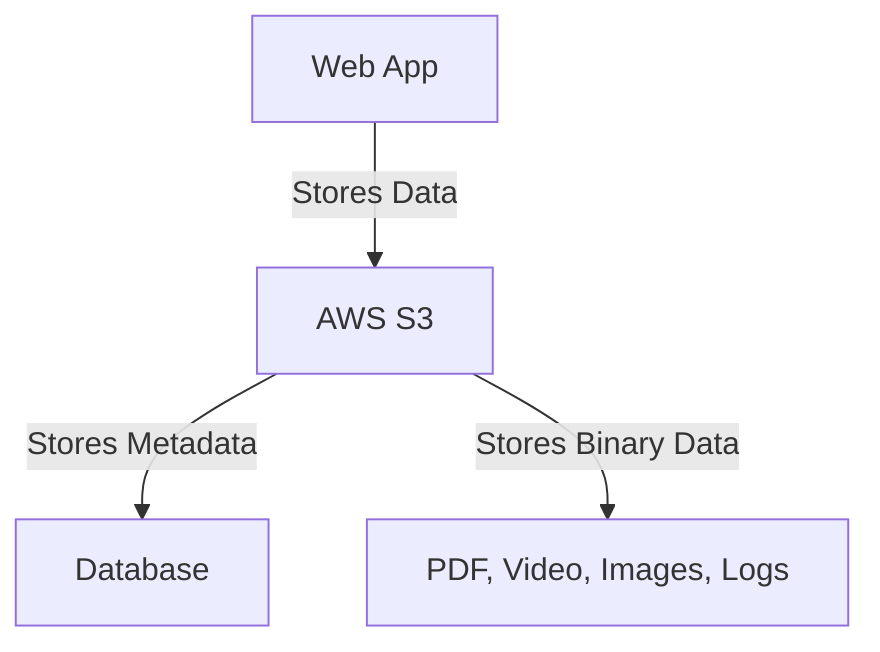
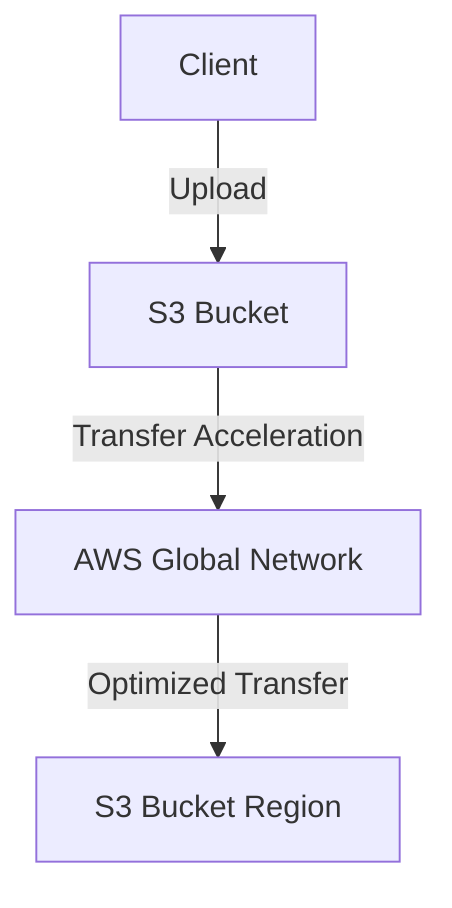
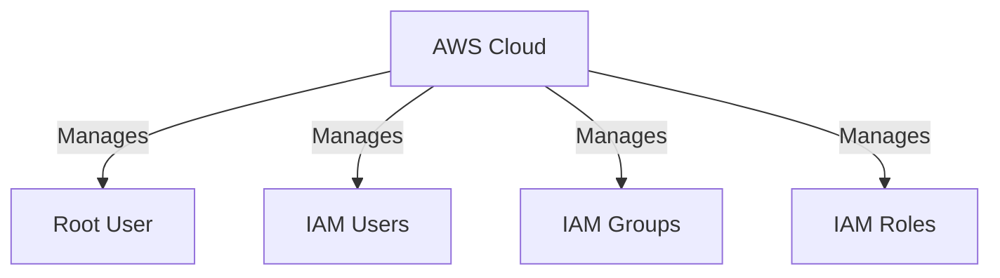
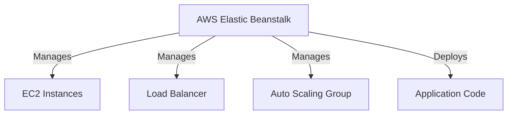

# AWS S3, IAM, and Elastic Beanstalk

## S3 - Simple Storage Service
- **Scalable Storage Service** that supports unlimited storage.
- **Object-Based Storage** (files, audio, video, images, PDFs, etc.).
- Data is stored in **buckets** with unique names.
- By default, **buckets and objects are private** (can be made public).

### S3 Advantages:
- **Unlimited Storage**
- **Scalability**
- **Availability**
- **Security**
- **Backup**

### S3 Features:
- **Multiple Buckets**: Can be created based on need.
- **Global Service**: Buckets are regional-specific.

## Static Website Hosting using S3
S3 can host **static websites** with the following features:
1. **Versioning**
2. **Object Locking**
3. **Transfer Acceleration**
4. **Storage Classes**

### S3 Versioning
- Maintains **multiple versions** of the same file.
- Disabled by default but can be enabled under **Bucket Properties**.
- Prevents overwriting of files.
- Once enabled, **cannot be disabled**, only suspended.

### S3 Storage Classes
- **Standard**: Frequently accessed data (millisecond access).
- **Intelligent-Tiering**: For data with unknown access patterns.
- **Standard-IA**: Infrequently accessed data.
- **One Zone-IA**: Low-cost, infrequently accessed data.
- **Glacier Instant Retrieval**: Data retrieval within milliseconds.
- **Glacier Flexible Retrieval**: Long-term data storage, retrieved within minutes to hours.
- **Glacier Deep Archive**: Lowest-cost storage for long-term archival data.

### Object Lock
- Uses **WORM (Write Once Read Many)** model.
- Prevents objects from being deleted/overwritten.
- Works only in **versioned buckets**.

### Transfer Acceleration
- **Speeds up data transfer** to S3.
- Optimizes file uploads over long distances.

## IAM (Identity & Access Management)
- Manages **users, groups, policies, and roles**.
- Provides **secure access control** in AWS.

### IAM Accounts
1. **Root Account** - Full access, no restrictions.
2. **IAM Accounts** - Limited permissions for security.

### Key Points for Root Account Security:
- **Avoid using Root Account for daily tasks**.
- **Do not share Root Account credentials**.
- **Enable MFA (Multi-Factor Authentication).**
- **IAM users should have specific access** instead of full privileges.

## AWS Elastic Beanstalk
Elastic Beanstalk is a **Platform as a Service (PaaS)** that helps deploy web applications quickly.

### Service Models
1. **IaaS (Infrastructure as a Service)** - EC2, VPC, S3, RDS.
2. **PaaS (Platform as a Service)** - Elastic Beanstalk.
3. **SaaS (Software as a Service)** - Fully managed applications.

---