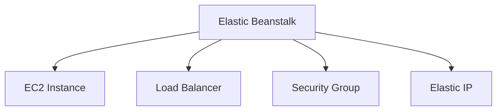

## AWS Elastic Beanstalk - Complete Notes

### ☁️ Cloud Service Models

1. **IaaS (Infrastructure as a Service)**
   - Examples: EC2, S3, RDS, VPC
   - Provides virtualized computing resources over the internet.

2. **PaaS (Platform as a Service)**
   - Example: AWS Elastic Beanstalk
   - Provides a ready-made platform to deploy, run, and manage applications without managing the infrastructure.

3. **SaaS (Software as a Service)**
   - Examples: Zoom, Microsoft Teams
   - Ready-to-use software delivered over the internet.

---

### 🚀 Web Application Deployment: Manual Steps

1. Create Network VPC
2. Create Security Groups
3. Enable Inbound Rules
4. Create EC2 Instances
5. Install required software (Java, Tomcat, IIS, etc.)
6. Configure Load Balancer
7. Setup Auto Scaling Groups for High Availability
8. Deploy your Application

> ✅ **Elastic Beanstalk automates steps 1-7. You only need to deploy your application!**

---

### 💡 Elastic Beanstalk Overview

- Elastic Beanstalk is a **PaaS** offered by AWS.
- It provides an end-to-end platform for web application deployment and management.
- No need to manage infrastructure like EC2, Load Balancer, Auto Scaling, etc.
- You only manage your code and deployment.

> 📌 **Billing Note:**
> Elastic Beanstalk itself is free. You pay for the AWS resources it provisions, such as:
> - EC2 Instances
> - Load Balancer (LB)
> - Auto Scaling Groups (ASG)

---

### 🧪 Lab Task: Deploying via Elastic Beanstalk

**Step-by-Step:**

1. **Create an IAM Role** with policies:
   - `AWSElasticBeanstalkMulticontainerDocker`
   - `AWSElasticBeanstalkWebTier`
   - `AWSElasticBeanstalkWorkerTier`

2. **Create an Application** via Elastic Beanstalk Console or CLI.

3. **Create an Environment**:
   - Choose runtime (e.g., Java, Python, Node.js, etc.)
   - Deploy your code.

> ✅ After deployment, Elastic Beanstalk generates a DNS endpoint to access your application.

---

### 📊 Billing Models Comparison

#### Elastic Beanstalk (PaaS)

- **Pay-as-you-go** pricing model

#### EC2 Virtual Machine
- Hourly Billing
- Pay-as-you-go based on compute time used

---

### 🌀 AWS Lambda & Serverless Computing

**AWS Lambda**
- Event-driven compute service
- Charges only for actual compute time
- No charge when code is not running

**Serverless Computing**
- No need to manage servers
- Code scales automatically with requests
- AWS handles provisioning, scaling, and patching

> ✅ **Billing Example**: If Lambda executes for 10 minutes, billing is done only for those 10 minutes.

---

### ✅ Summary
- Elastic Beanstalk simplifies deployment by handling infrastructure.
- Great for developers who want to focus on code.
- Ideal for scalable, production-ready web apps.
- Pay only for underlying resources, not the Beanstalk service itself.
- AWS Lambda is an efficient option for serverless, event-driven applications.

