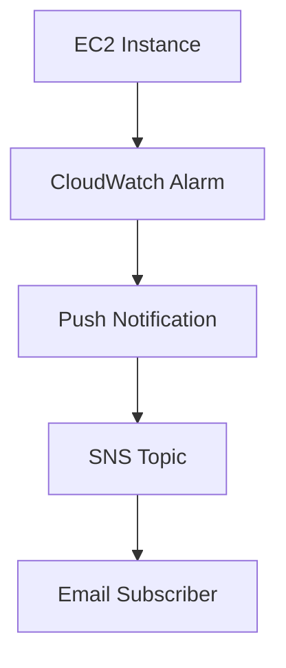

## AWS CloudWatch, SNS & AWS CLI - Notes

---

### 📈 CloudWatch & SNS Monitoring

**Amazon CloudWatch** is a monitoring service for AWS cloud resources and applications running on AWS. It:
- Provides **real-time monitoring** for resources like EC2, Load Balancers, RDS, and EBS.
- Automatically collects metrics such as:
  - Latency
  - Request Count
  - CPU Utilization

**AWS SNS (Simple Notification Service)** is used for sending notifications (email, SMS, etc.) based on CloudWatch alarms.

#### 🔁 Flow Diagram (Mermaid)


---

### 🧪 Practical Task: CloudWatch + SNS

**Objective:** Notify via email when CPU usage goes above 2% for an EC2 instance.

1. **Create SNS Topic** with Email Notification (Standard Create)
2. **Subscribe to Topic** (Confirm via email)
3. **On EC2 instance:**
   - Go to *Monitor > Manage CloudWatch Alarms*
   - Create a new alarm
   - Set **Alarm Threshold**: CPU Utilization > 2%
   - In *Notification*, select the created SNS topic
4. Increase load on the EC2 to simulate high CPU usage
5. Watch for CloudWatch to trigger an alarm
6. Email notification is sent when status changes to **"In Alarm"**

> ✅ **To view alarm history:**
> Go to CloudWatch → Select Alarm → Click Alarm → Click on History

---

## 💻 AWS CLI (Command Line Interface)

### Overview
- Provides **flexibility** to manage AWS resources from terminal.
- Alternatives: AWS Web Console, AWS SDKs (Java, Python), and tools like Terraform.

### 🔧 Installation (Windows)
- Download: [AWS CLI v2 MSI (64-bit)](https://awscli.amazonaws.com/AWSCLIV2.msi)

### 🔐 Configure AWS CLI
1. Create IAM user with programmatic access (Access Key + Secret Key)
2. Run command:
```bash
aws configure
```
3. Provide:
   - Access Key
   - Secret Key
   - Region (e.g., `us-east-1`)
   - Output format (e.g., `json`)

Example configuration:
```bash
$ aws configure
AWS Access Key ID: AKIA****************
AWS Secret Access Key: **********************
Default region: ap-south-1
Default output format: json
```

---

### 🔍 Common AWS CLI Commands

**List S3 Buckets:**
```bash
aws s3 ls
```

**Create a Bucket:**
```bash
aws s3 mb s3://telusko123
```

**Delete Empty Bucket:**
```bash
aws s3 rb s3://telusko123
```

📘 **Docs:** [AWS CLI Documentation](https://awscli.amazonaws.com/v2/documentation/api/latest/index.html)

Use this to find commands for every AWS service and action.

