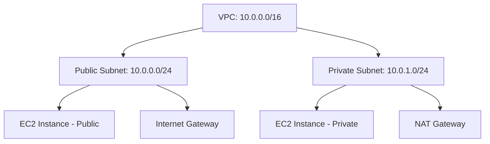

## AWS VPC (Virtual Private Cloud) & IP Notes

---

### 🔒 What is VPC?

- **VPC (Virtual Private Cloud)** provides an isolated and secure environment to launch AWS resources.
- Users can define custom:
  - IP ranges
  - Subnets (public/private)
  - Route tables
  - Internet/NAT gateways

**Benefits:**
- Full control over inbound and outbound traffic
- Better network isolation and segmentation

---

### 🧱 VPC Terminology

1. **VPC** – A logically isolated section of AWS.
2. **Subnets** – Can be Public or Private.
3. **CIDR Block** – Defines the IP range.
4. **Route Tables** – Controls routing between subnets.
5. **Internet Gateway (IGW)** – Allows communication between VPC and internet.
6. **NAT Gateway** – Allows private subnet instances to connect to the internet.
7. **VPC Peering** – Connects two VPCs for communication.
8. **Security Groups** – Instance-level firewalls.
9. **NACL (Network ACL)** – Subnet-level firewalls.

---

### 📶 IP Addressing in AWS

- **IPv4**: 32-bit, e.g., 192.168.1.1 → 4.3 billion unique addresses
- **IPv6**: 128-bit, e.g., 2001:db8:85a3:0000:0000:8a2e:0370:7334 → 340 undecillion addresses

**Types of IPs:**
- Public IP
- Private IP
- Static IP
- Dynamic IP

**CIDR (Classless Inter-Domain Routing)**: Used to allocate IP ranges. For example:
- `10.0.0.0/16` → 65,536 IPs
- `10.0.0.0/24` → 256 IPs

---

### 📏 VPC Sizing

**Formula:**
```
2^(32 - subnet mask) = Number of IPs
```
Examples:
- `/16` = 65,536 IPs
- `/24` = 256 IPs
- `/29` = 8 IPs (AWS reserves 5 → usable = 3)

> ✅ AWS supports subnet mask ranges from `/16` to `/28`

**Best Practice:** Use `/24` for standard subnets

#### VPC Diagram (Mermaid)


---

### 🛠️ Practical Task: Create and Configure VPC

1. **Create VPC**
   - CIDR: 10.0.0.0/16
   - Default settings, click Create

2. **Create Subnets**
   - `telusko-public-sn`: 10.0.0.0/24
   - `telusko-private-sn`: 10.0.1.0/24

3. **Route Tables**
   - Rename default: `private-telusko-rt`
   - Create: `public-telusko-rt`
   - Associate subnets:
     - `public-telusko-sn` → `public-telusko-rt`
     - `private-telusko-sn` → `private-telusko-rt`

4. **Internet Gateway (IGW)**
   - Create and attach to VPC: `telusko-igw`
   - Add route in public-telusko-rt → `0.0.0.0/0` → `telusko-igw`

5. **Launch EC2 Instances**
   - One in Public Subnet
   - One in Private Subnet

6. **Test Connectivity**
   - SSH into public EC2
   - From public EC2, SSH into private EC2
   - Direct internet access fails for private EC2 (as expected)

---

### ✅ Summary
- VPC gives you control over networking in AWS
- Subnetting helps divide traffic securely
- CIDR sizing crucial for IP planning
- IGW & NAT enable public/private network design
- Security Groups and NACLs provide network security

