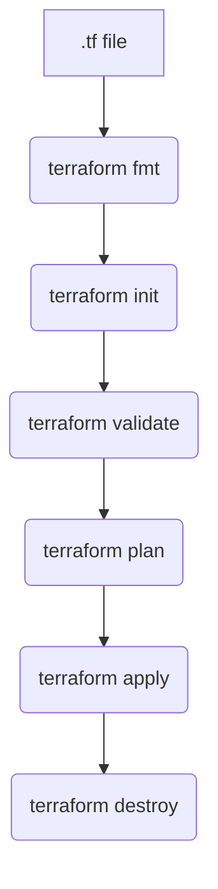

## Terraform - Infrastructure as Code (IaC) Notes

---

### 🌍 What is Terraform?
- Open-source tool developed by HashiCorp
- Used to **provision infrastructure in cloud platforms** using IaC
- Supports major cloud providers like AWS, Azure, GCP, etc.
- Terraform scripts are written in **HCL (HashiCorp Configuration Language)**

---

### ⚙️ Terraform Installation (Linux VM)
1. Launch Amazon Linux EC2 instance
2. Connect via GitBash or MobaXterm
3. Run setup commands:
```bash
sudo yum install -y yum-utils shadow-utils
sudo yum-config-manager --add-repo https://rpm.releases.hashicorp.com/AmazonLinux/hashicorp.repo
sudo yum -y install terraform
```
4. Verify Installation:
```bash
terraform -v
```

---

### 🧱 Terraform Workflow Architecture



---

### 🧪 Basic Terraform Script to Create EC2
```hcl
provider "aws" {
  region     = "ap-south-1"
  access_key = "<ACCESS_KEY>"
  secret_key = "<SECRET_KEY>"
}

resource "aws_instance" "linux-vm" {
  ami           = "ami-002f6e91abffe6b96"
  instance_type = "t2.micro"
  key_name      = "terraform"
  security_groups = ["default"]

  tags = {
    Name = "Telusko-Linux_VM"
  }
}
```

---

### 🔐 Managing Access Keys Securely
Instead of storing keys in the script, use environment variables:
```bash
export AWS_ACCESS_KEY_ID="<ACCESS_KEY>"
export AWS_SECRET_ACCESS_KEY="<SECRET_KEY>"
```

---

### 🚀 EC2 With User Data (Startup Script)
**Script (installHttpd.sh):**
```bash
#!/bin/bash
sudo su
yum install httpd -y
cd /var/www/html
echo "<h1> Welcome to Telusko WebServer </h1>" > index.html
service httpd start
```

**Resource file:**
```hcl
resource "aws_instance" "linux-vm" {
  ami           = "ami-002f6e91abffe6b96"
  instance_type = "t2.micro"
  key_name      = "terraform"
  security_groups = ["default"]
  user_data     = file("installHttpd.sh")
  tags = {
    Name = "DevOps-Linux_VM"
  }
}
```

---

### 📦 Using Variables
**vars.tf**
```hcl
variable "ami" {
  description = "Amazon vm image value"
  default     = "ami-002f6e91abffe6b96"
}

variable "instance_type" {
  description = "Represents the type of instance"
  default     = "t2.micro"
}
```

**main.tf**
```hcl
resource "aws_instance" "linux-vm" {
  ami           = var.ami
  instance_type = var.instance_type
  key_name      = "terraform"
  security_groups = ["default"]
  tags = {
    Name = "var-Linux_VM"
  }
}
```

**provider.tf**
```hcl
provider "aws" {
  region = "ap-south-1"
}
```

---

### 🔁 Input/Output Variables
**input-vars.tf**
```hcl
variable "ami" {
  default = "ami-002f6e91abffe6b96"
}

variable "instance_type" {
  default = "t2.micro"
}
```

**output.tf**
```hcl
output "ec2_vm_info" {
  value = aws_instance.linux_vm
}

output "ec2_vm_public_ip" {
  value = aws_instance.linux_vm.public_ip
}
```

---

### 🪣 Create S3 Bucket
```hcl
resource "aws_s3_bucket" "telusko_bucket" {
  bucket = "telusko4343"
  acl    = "private"

  versioning {
    enabled = true
  }
}
```

---

### 👤 Create IAM User
```hcl
resource "aws_iam_user" "example_user" {
  name = "my-example-user"
}

resource "aws_iam_user_policy_attachment" "example_user_policy" {
  user       = aws_iam_user.example_user.name
  policy_arn = "arn:aws:iam::aws:policy/AdministratorAccess"
}
```

> 💡 Next step suggestion: **Provision RDS instance** and output DB endpoint using Terraform.

