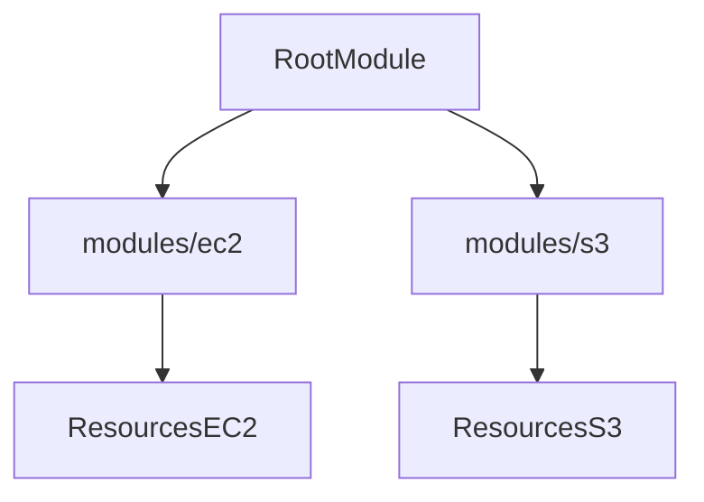

## Terraform Modules & Advanced Usage

---

### 🧱 Terraform Modules Overview

- A **Terraform module** is a container for multiple .tf files grouped in a directory.
- Modules enable code reuse, modularity, and cleaner infrastructure organization.

> Even a directory with a single `.tf` file is considered a module.

---

### 📦 Root Module vs Child Modules

- **Root Module**: The project root where Terraform commands are executed.
- **Child Modules**: Modular folders for reusable infrastructure components like EC2, S3, RDS, etc.

#### 📁 Folder Structure Example
```bash
05-terraform-modules-project/
├── provider.tf
├── main.tf
├── output.tf
├── modules/
│   ├── ec2/
│   │   ├── input.tf
│   │   ├── main.tf
│   │   ├── output.tf
│   └── s3/
│       ├── input.tf
│       ├── main.tf
│       ├── output.tf
```

#### 🪜 Execution Flow:


---

### 🚀 Steps to Create Terraform Project with Modules

1. **Create Project Directory**
```bash
mkdir 05-terraform-modules-project
```

2. **Create `provider.tf`**
```hcl
provider "aws" {
  region = "us-east-1"
}
```

3. **Create Modules Folder & Subfolders**
```bash
mkdir -p modules/ec2
mkdir -p modules/s3
```

4. **Create EC2 Module Files**: `input.tf`, `main.tf`, `output.tf`
```hcl
# input.tf
variable "ami" {
  description = "Amazon VM Image"
  type        = string
}

variable "instance_type" {
  description = "EC2 type"
  default     = "t2.micro"
}

# output.tf
output "ec2_vm_public_ip" {
  value = aws_instance.linux_vm.public_ip
}
output "ec2_vm_private_ip" {
  value = aws_instance.linux_vm.private_ip
}

# main.tf
resource "aws_instance" "linux_vm" {
  ami           = var.ami
  instance_type = var.instance_type
  key_name      = "terraform"
  security_groups = ["default"]
  tags = {
    Name = "modules-Linux_VM"
  }
}
```

5. **Create S3 Module File (main.tf)**
```hcl
resource "aws_s3_bucket" "telusko_bucket" {
  bucket = "telusko4455"
  acl    = "private"
}
```

6. **Include Modules in Root `main.tf`**
```hcl
module "my_ec2" {
  source = "./modules/ec2"
  ami    = "ami-002f6e91abffe6b96"
}

module "my_s3" {
  source = "./modules/s3"
}
```

7. **Expose Module Output** (in root `output.tf`)
```hcl
output "ec2_vm_public_ip" {
  value = module.my_ec2.ec2_vm_public_ip
}

output "ec2_vm_private_ip" {
  value = module.my_ec2.ec2_vm_private_ip
}
```

---

### 🪟 Working with Terraform on Windows

1. Download `.zip` from terraform.io and extract
2. Set Terraform path in **Environment Variables**
3. Set AWS credentials in **System Environment Variables**
4. Install **VS Code** or editor of choice

---

### 💣 Taint and Untaint in Terraform

- `terraform taint <resource>`
  - Marks a resource to be destroyed and recreated on next `apply`

- `terraform untaint <resource>`
  - Cancels a previously tainted resource

Example:
```bash
terraform taint aws_instance.linux_vm
terraform untaint aws_instance.linux_vm
```

---

### 📍 State and Lock Files

- `.tfstate` — Tracks infrastructure state
- `.lock.hcl` — Locks provider versions to avoid conflicts in CI/CD

---

### ✅ Final Terraform Commands
```bash
terraform init
terraform fmt
terraform validate
terraform plan
terraform apply --auto-approve
terraform destroy --auto-approve
```

