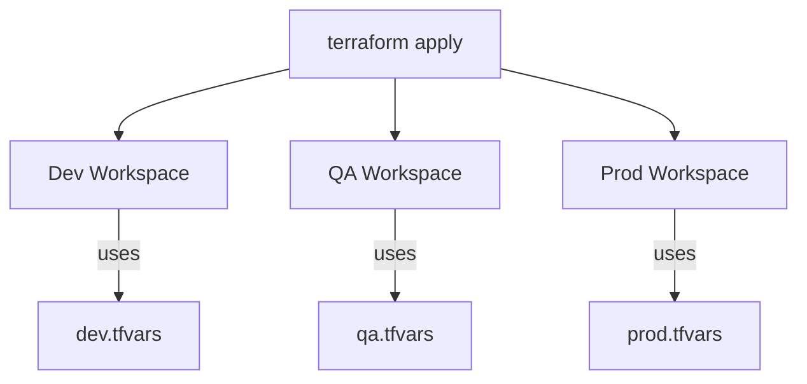

## Terraform Workspaces & Ansible Automation Notes

---

### 🧭 Terraform Workspaces & Environments

**Environments** like `Dev`, `QA`, `UAT`, `PILOT`, `PROD` are setups needed to run applications across different stages.

#### ✅ Workspace Benefits
- Maintain **separate state files** for each environment
- Use the **same codebase** with different variable files (`.tfvars`)

#### 🌍 Example
```bash
terraform apply -var-file=dev.tfvars     # Applies for Dev
terraform apply -var-file=qa.tfvars      # Applies for QA
```

#### Diagram: Workspaces in Action


#### 🔧 Workspace Commands
```bash
terraform workspace show              # Check current workspace
terraform workspace list              # List all workspaces
terraform workspace new dev           # Create new workspace
terraform workspace select dev        # Switch to dev workspace
terraform apply -var-file=dev.tfvars  # Run for dev environment
```

---

### 🧰 Terraform Recap Overview

- **IAC Concepts**
  - Terraform Setup (Linux + Windows)
  - Terraform CLI: `init`, `fmt`, `validate`, `plan`, `apply`, `destroy`
  - Terraform Modules
  - Variables (Input/Output)
  - Workspaces
  - Taint & Untaint
  - Lock Files
  - Resources: EC2, S3, RDS, VPC, IAM

---

## ⚙️ Ansible: Automation and Configuration Management

### 🛠️ What is Ansible?
- Open-source IT automation tool
- Developed by **Michael DeHaan** in 2012
- Acquired by Red Hat (IBM-owned)

### 🔄 Used For:
- Configuration Management
- Application Deployment
- Task Automation
- Orchestration

### 📉 Problems Solved
- Manual setups are **time-consuming**, **error-prone**, and **repetitive**

---

### 🧱 Ansible Architecture
- **Controlling Node**: System where Ansible is installed and commands are run
- **Managed Nodes**: Target systems being configured
- **Inventory File**: Defines managed hosts
- **Playbooks**: YAML files containing tasks to automate

#### 💡 Concepts
- One Control Node manages multiple EC2s
- Host inventory file groups web and database servers

#### Diagram: Ansible Workflow
```mermaid
graph TD
    A[Control Node] -->|runs| B[Playbook (YAML)]
    A -->|connects via SSH| Web[Web Server EC2]
    A -->|connects via SSH| DB[Database EC2]
    Inventory[Host Inventory File] --> A
```

---

### 🧪 Ansible Setup Task

1. Create **3 Linux EC2 VMs**:
   - 1 Control Node (with Ansible)
   - 2 Managed Nodes (target EC2s)

2. Configure SSH access from control to managed nodes
3. Write a basic playbook to install `httpd`, copy files, or update packages on managed nodes

> This setup enables centralized and repeatable configuration without manual login to each VM.

---

Let me know if you want to include:
- Sample Ansible Playbook YAML
- Dynamic inventory support
- EC2 provisioning + configuration in one automated flow

