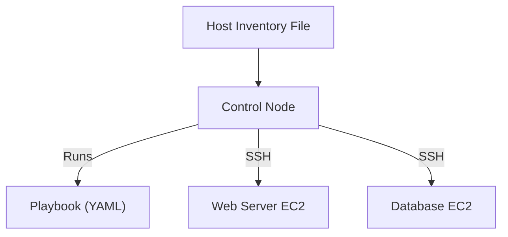

## ⚙️ Ansible: Automation and Configuration Management

### 🛠️ What is Ansible?
- Open-source IT automation tool
- Developed by **Michael DeHaan** in 2012
- Acquired by Red Hat (IBM-owned)

### 🔄 Used For:
- Configuration Management
- Application Deployment
- Task Automation
- Orchestration

### 📉 Problems Solved
- Manual setups are **time-consuming**, **error-prone**, and **repetitive**

---

### 🧱 Ansible Architecture
- **Controlling Node**: System where Ansible is installed and commands are run
- **Managed Nodes**: Target systems being configured
- **Inventory File**: Defines managed hosts
- **Playbooks**: YAML files containing tasks to automate

#### 💡 Concepts
- One Control Node manages multiple EC2s
- Host inventory file groups web and database servers

#### Diagram: Ansible Workflow


---

### 🧪 Ansible Setup Task (Step-by-Step)

#### 1. Create 3 Linux EC2 VMs:
- 1 Control Node
- 2 Managed Nodes

#### 2. Setup User & Configure Sudo + SSH Access on All Nodes:
```bash
# a. Create ansible user
sudo useradd ansible
sudo passwd ansible

# b. Add ansible to sudoers
sudo visudo
ansible ALL=(ALL) NOPASSWD: ALL

# c. Allow password-based SSH login
sudo vi /etc/ssh/sshd_config
PermitEmptyPasswords yes

# d. Restart SSH service
sudo service sshd restart
```

#### 3. Install Ansible on Control Node:
```bash
# a. Switch to ansible user
sudo su - ansible
cd ~

# b. Install Python
sudo yum install python3 -y
python3 --version

# c. Install pip and Ansible
sudo yum -y install python3-pip
pip3 install ansible
ansible --version
```

#### 4. Generate SSH Key and Share with Managed Nodes:
```bash
# a. Generate key
ssh-keygen

# b. Copy to managed nodes
ssh-copy-id ansible@<managed-node-ip>
```

#### 5. Configure Host Inventory:
```bash
sudo vi /etc/ansible/hosts

[webservers]
172.31.30.0
172.31.80.88
```

#### 6. Test Ansible Connection:
```bash
ansible all -m ping
```

---

### ⏱️ Ansible Ad-Hoc Commands
```bash
ansible all -m ping
ansible all -m shell -a "date"
ansible all -m shell -a "uptime"
ansible webservers -m yum -a "name=git"
```

---

### 📘 Ansible Playbooks
- Playbooks are YAML files defining multiple tasks
- Sections:
  1. **Host Section**: Target machines
  2. **Variable Section**: Define variables
  3. **Task Section**: Operations to run

#### 📝 Example YAML Snippet
```yaml
---
employee:
  id: 1
  name: Rohan
  address:
    city: Bengaluru
    country: India
  skills:
    - java
    - python
    - devOps
```

> To run playbooks:
```bash
ansible-playbook <playbook.yml>
```

---

Let me know if you want to include:
- Sample playbooks for installing services (httpd, git)
- Roles and handlers breakdown
- Dynamic inventory setup

