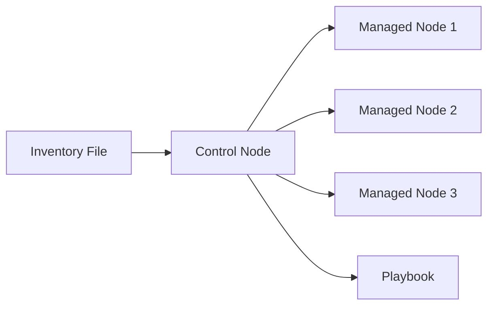

## Ansible Basics

### Components

* **CN**: Control Node (Where Ansible is installed)
* **MN**: Managed Node
* **Inventory File**: Lists managed nodes
* **Adhoc Commands**: For simple one-time tasks

### Playbook Structure (YAML)

```yaml
- hosts: section
- vars: section
- tasks: section
```

---

## Setup Instructions

1. Start all managed and control nodes.
2. Get connected to control node (Ansible must be installed).
3. Ensure ansible user and directory are ready.
4. Switch to ansible user:

```bash
$ sudo su ansible
```

5. Go to ansible directory:

```bash
$ cd ~ or cd .ansible
$ pwd
/home/ansible/
```

---

## Creating & Running Playbook: 01-ping.yml

```bash
$ vi 01-pi
```

```yaml
---
- hosts: all
  tasks:
    - name: Ping all managed nodes
      ping:
      remote_user: ansible
```

```bash
$ ansible-playbook 01-ping.yml
```

### Verbosity

```bash
$ ansible-playbook 01-ping.yml -v     # basic
$ ansible-playbook 01-ping.yml -vv    # more detail
$ ansible-playbook 01-ping.yml -vvv   # extensive
$ ansible-playbook 01-ping.yml -vvvv  # extremely verbose
```

### Syntax Check

```bash
$ ansible-playbook 01-ping.yml --syntax-check
```

### List Hosts

```bash
$ ansible-playbook 01-ping.yml --list-hosts
```

### Step Execution

```bash
$ ansible-playbook 01-ping.yml --step
```

### Dry Run

```bash
$ ansible-playbook 01-ping.yml --check
```

---

## Create Files in Managed Nodes

### Playbook: 02-create-file.yml

```yaml
---
- hosts: all
  tasks:
    - name: Create file in all managed nodes
      file:
        path: /home/ansible/alien.txt
        state: touch
```

```bash
$ ansible-playbook 02-create-file.yml
```

---

## Install Git in Managed Nodes (Assignment: Install Maven similarly)

### Playbook: 03-install-git.yml

```yaml
---
- hosts: all
  become: true
  tasks:
    - name: Installing Git in all Managed Nodes
      yum:
        name: git
        state: latest
```

```bash
$ ansible-playbook 03-install-git.yml --syntax-check
$ ansible-playbook 03-install-git.yml
```

---

## Static Website Hosting (Webserver Group Only)

### Playbook: 04-website-hosting.yml

```yaml
---
- hosts: webservers
  become: true
  tasks:
    - name: install httpd package
      yum:
        name: httpd
        state: latest
    - name: copy index.html file
      copy:
        src: index.html
        dest: /var/www/html/index.html
    - name: start httpd server
      service:
        name: httpd
        state: started
```

```bash
$ ansible-playbook 04-website-hosting.yml --list-hosts
$ ansible-playbook 04-website-hosting.yml --syntax-check
$ ansible-playbook 04-website-hosting.yml
```

---

## Variables in Ansible

### Types:

1. Runtime Variable
2. Playbook Variable
3. Group Variable
4. Host Variable

### 1. Runtime Variable

```yaml
- hosts: webservers
  become: true
  tasks:
    - name: install {{package_name}}
      yum:
        name: "{{package_name}}"
        state: latest
    - name: copy index.html file
      copy:
        src: index.html
        dest: /var/www/html/index.html
    - name: start {{package_name}}
      service:
        name: "{{package_name}}"
        state: started
```

```bash
$ ansible-playbook <yml_file> --extra-vars package_name=httpd
```

### 2. Playbook Variable

```yaml
- hosts: webservers
  become: true
  vars:
    package_name: httpd
  tasks:
    - name: install {{package_name}}
      yum:
        name: "{{package_name}}"
        state: latest
    - name: copy index.html
      copy:
        src: index.html
        dest: /var/www/html/index.html
    - name: start {{package_name}}
      service:
        name: "{{package_name}}"
        state: started
```

---

## Group and Host Variables

### Group Variable

```bash
$ mkdir /etc/ansible/group_vars
$ sudo vi /etc/ansible/group_vars/webservers.yml
package_name: java
$ sudo vi /etc/ansible/group_vars/dbservers.yml
package_name: mysql
```

### Host Variable

```bash
$ mkdir /etc/ansible/host_vars
$ sudo vi /etc/ansible/host_vars/hostname.yml
# or
$ sudo vi /etc/ansible/host_vars/172.130.0.1.yml
```

---

## Handlers and Tags

### Example: 05-handlers.yml

```yaml
- hosts: webservers
  become: true
  vars:
    package_name: httpd
  tasks:
    - name: installing httpd
      yum:
        name: "{{package_name}}"
        state: latest
      tags:
        - install
    - name: copy index.html
      copy:
        src: index.html
        dest: /var/www/html/index.html
      tags:
        - copy
      notify:
        - starting httpd
  handlers:
    - name: starting httpd
      service:
        name: "{{package_name}}"
        state: started
```

```bash
$ ansible-playbook 05-handlers.yml --syntax-check
$ ansible-playbook 05-handlers.yml --list-tags
$ ansible-playbook 05-handlers.yml --tags "copy"
$ ansible-playbook 05-handlers.yml --skip-tags "install,copy"
```

---

## Ansible Vault

### Encrypt

```bash
$ ansible-vault encrypt <playbook.yml>
```

### Decrypt

```bash
$ ansible-vault decrypt <playbook.yml>
```

### Edit

```bash
$ ansible-vault edit <playbook.yml>
```

### View without decrypting

```bash
$ ansible-vault view encrypt <playbook.yml>
```

---

## Diagram: Ansible Control and Managed Nodes


