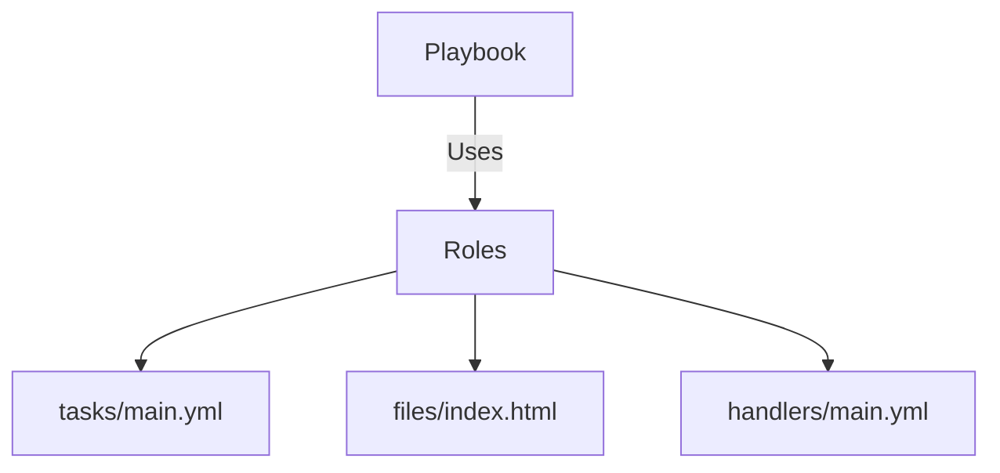

## Ansible Roles

### Purpose

Whenever there are more tasks or more functionalities in our playbooks, it becomes difficult to manage and maintain.

Ansible Roles allow us to break down a complex playbook into separate, smaller chunks that can be coordinated by a central entry point.

### Directory Structure

```text
roles/
└── apache/
    ├── tasks/
    │   └── main.yml
    ├── files/
    │   └── index.html
    └── handlers/
        └── main.yml
```

### Steps to Use Roles

```bash
sudo su ansible
cd ~
pwd  # /home/ansible
mkdir roles
cd roles
ansible-galaxy init apache  # apache role is created
tree apache
```

### tasks/main.yml

```yaml
---
# tasks file for apache
- name: httpd
  yum:
    name: httpd
    state: present
- name: copy index.html
  copy:
    src: index.html
    dest: /var/www/html/index.html
  notify:
    - restart apache
```

### files/index.html

```html
<h1>data</h1>
```

### handlers/main.yml

```yaml
---
# handlers file for apache
- name: restart apache
  service:
    name: httpd
    state: restarted
```

### runsetup.yml

```yaml
---
- hosts: webservers
  become: true
  roles:
    - apache
```

```bash
ansible-playbook runsetup.yml
```

---

## Ansible Tower

* A paid software managed by Red Hat
* Provides a web-based UI
* Allows to create, schedule, manage, and execute playbooks

---

## Webservers

### What is a Webserver?

* Server software used to run web applications
* Users (via browser, mobile, etc.) send requests to the server
* Server processes and responds to requests

### Examples:

* Tomcat
* JBoss
* Glassfish
* WebLogic
* IIS
* WebSphere

---

## Tomcat Server Deployment

### What is Tomcat?

* Free and open-source software by Apache
* Developed using Java
* Supports multiple OS
* Default port: **8080** (can be changed)

### Directory Structure

* **bin**: Contains start/stop scripts (startup.sh, shutdown.sh)
* **conf**: Contains config files (e.g., server.xml, tomcat-users.xml)
* **webapps**: Where .war files are placed for deployment
* **logs**: Stores log messages
* **lib**: Required JAR files
* **temp**: Temporary files

---

## Tomcat Web Application Deployment Steps

1. Create a Maven web application in the EC2 user home directory
2. Package project into a `.war` file:

```bash
$ mvn clean package
```

3. Copy `.war` file to webapps directory:

```bash
$ cp <app>/target/<warfile> <tomcat>/webapps
```

4. Start the server:

```bash
$ sh startup.sh
```

5. Ensure port 8080 is allowed in EC2 Security Group
6. Access web app using browser

---

## Tomcat Admin Console

* Used to manage and monitor the Tomcat server
* Port can be changed from `server.xml`

---

## Diagram: Ansible Role Structure


