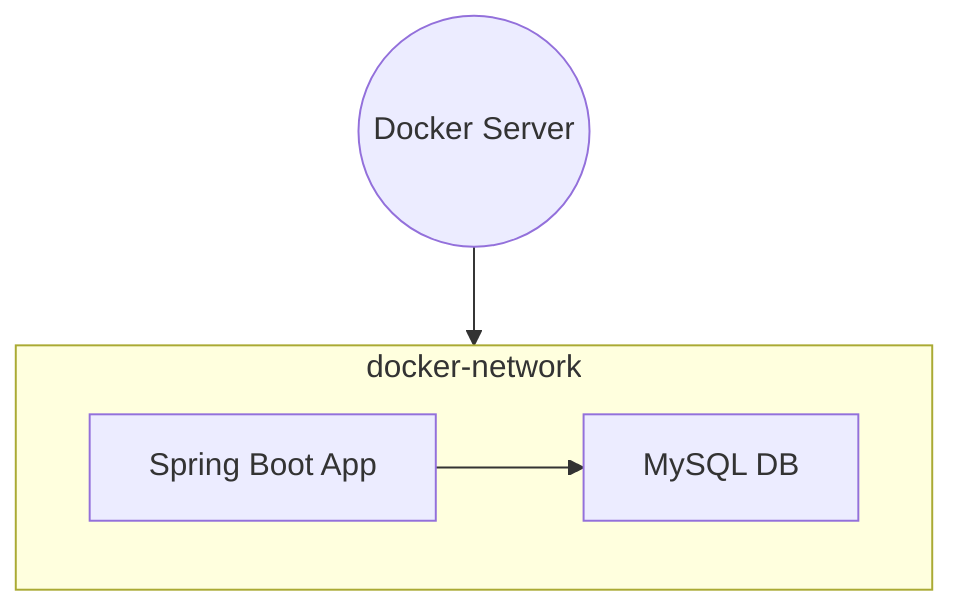
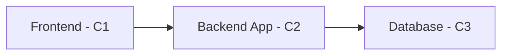
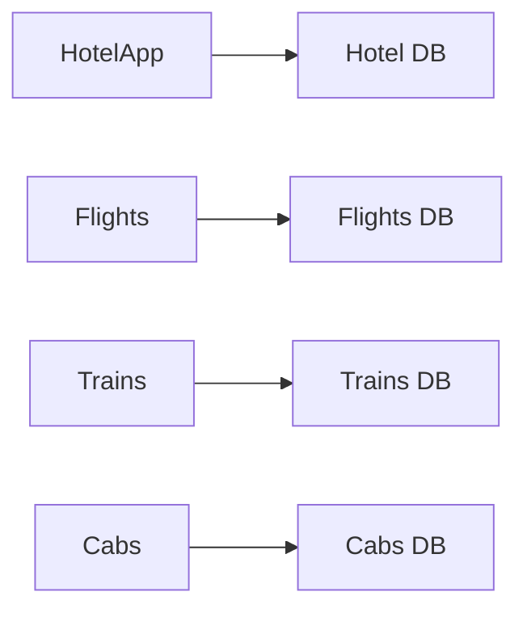

## Docker Lecture 4 Notes

### 📦 Docker Networking Recap

* Docker containers can communicate **internally** using Docker networks.
* Containers `C1` and `C2` inside the same **docker-network** can connect directly.
* Example: A Spring Boot app (Java) container can talk to a MySQL database container over a shared Docker network.

---

### 🖼 Multi-container Architecture

#### Example: Monolithic App Split

* **Frontend (FE)** in container `C1`
* **Backend App** in container `C2`
* **Database** in container `C3`

These three containers run together inside the same network and form an app deployment unit.

---

### 🧱 Microservices Setup

* Apps like **Hotels**, **Flights**, **Trains**, and **Cabs** each have their own containers
* Each service can have a separate **database container**

> This forms a microservices architecture: multiple isolated containers communicating via Docker network.

> In real-world deployments, Docker Compose or Kubernetes is used to manage these multi-container applications.

---
