# **AWS Free Tier Account Creation Guide**

Creating an AWS Free Tier account allows you to explore and utilize various AWS services within specified limits at no cost for the first 12 months. Follow the steps below to set up your account successfully.

### **Step 1: Visit the AWS Free Tier Page**

- Navigate to the [AWS Free Tier page](https://aws.amazon.com/free/).
- Click on **"Get Started for Free"**.

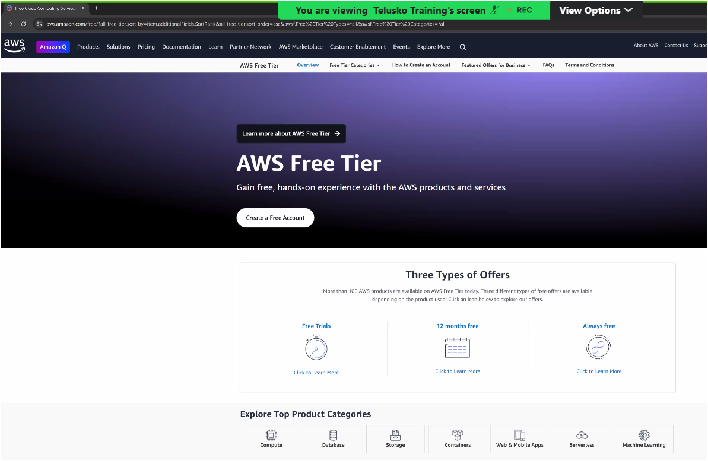

### **Step 2: Initiate Account Creation**

- Click on the **"Create a Free Account"** button.
  

### **Step 3: Provide Account Information**

- **Email Address**: Enter a valid email address that hasn't been registered with AWS.
- **Password**: Create a strong password that meets AWS's security requirements.
- **AWS Account Name**: Choose a unique name for your AWS account.
- Click on **"Continue"**.
  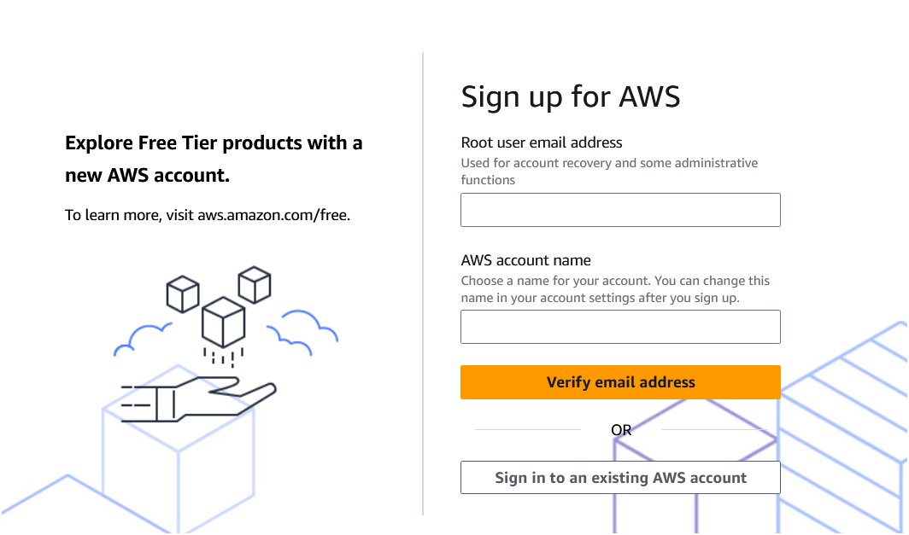
  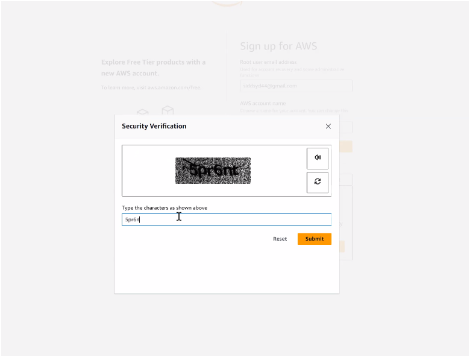
  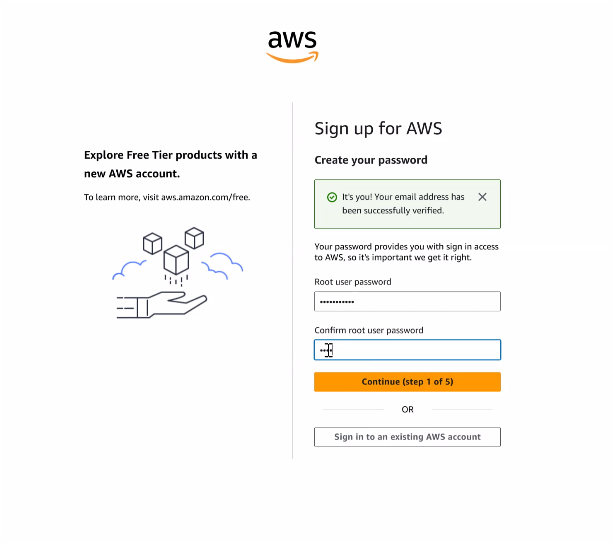

### **Step 4: Enter Contact Information**

- **Account Type**: Select "Personal" for individual use or "Professional" for business purposes.
- **Full Name**: Enter your full legal name.
- **Phone Number**: Provide a valid phone number for verification purposes.
- **Country/Region**: Select your country or region.
- **Address**: Fill in your complete address details.
- Click on **"Continue"**.
  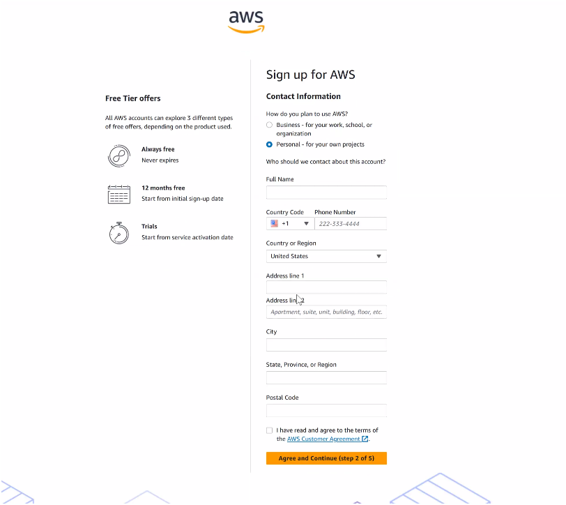

### **Step 5: Add Payment Information**

AWS requires a valid payment method to verify your identity and to charge for any usage that exceeds the Free Tier limits.

- **Credit and Debit Cards**: Visa, MasterCard, American Express, and RuPay.
- Enter your card details and click **"Verify and Add"**.

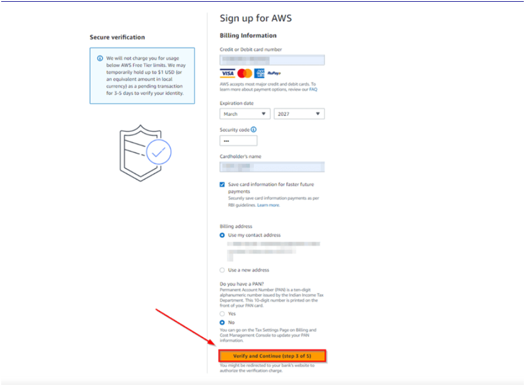
For more details on supported payment methods in India, refer to AWS's documentation on [Managing your payments in India](https://docs.aws.amazon.com/awsaccountbilling/latest/aboutv2/edit-aispl-payment-method.html).

### **Step 6: Verify Your Phone Number**

- Choose a contact method (SMS or voice call) to receive a verification code.
- Enter the code received and click on **"Verify Code"**.
- Click on **"Continue"**.

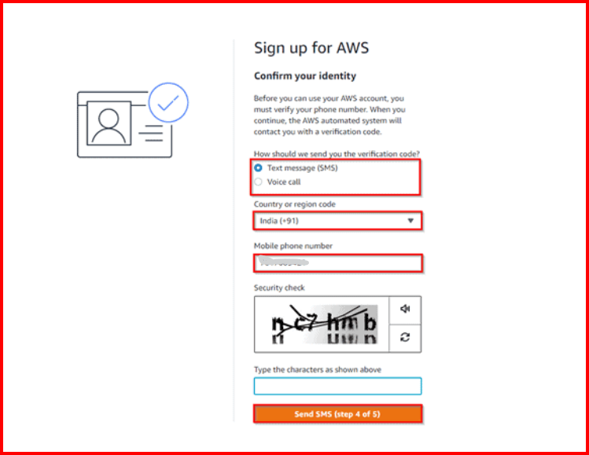
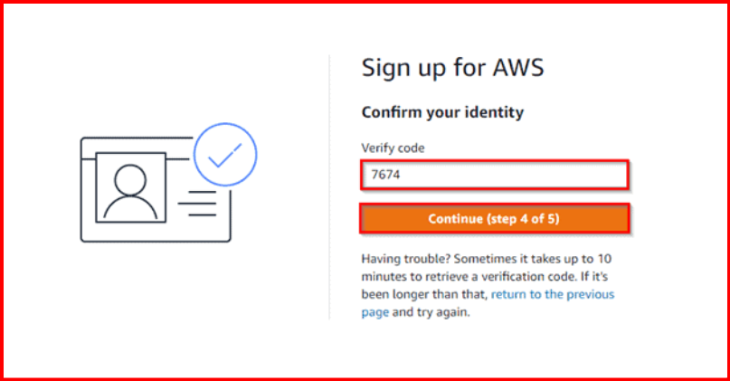
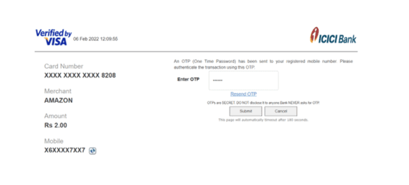

### **Step 7: Choose a Support Plan**

- Select the **Basic Support - Free** plan (recommended for Free Tier users).
- Click on **"Continue"**.

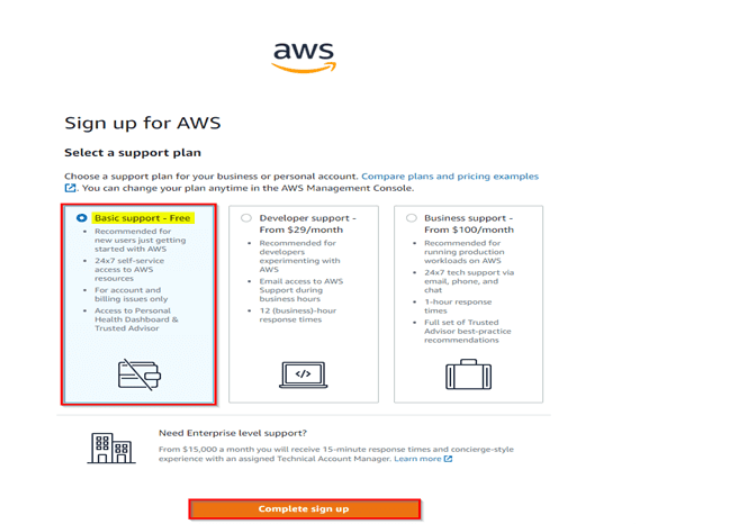
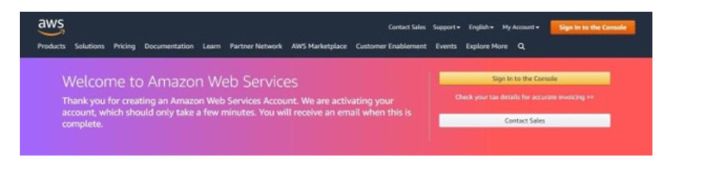

### **Step 8: Confirm Identity and Start Using AWS**

- Once all steps are completed, AWS will process your information.
- After verification, you can log in to your AWS account.
- Click on **"Sign in to the Console"** to start exploring Free Tier services.

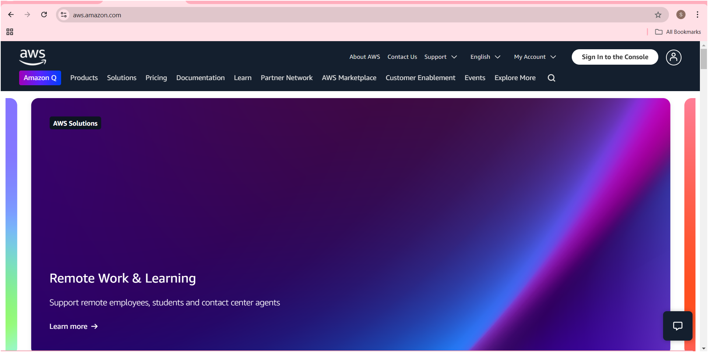
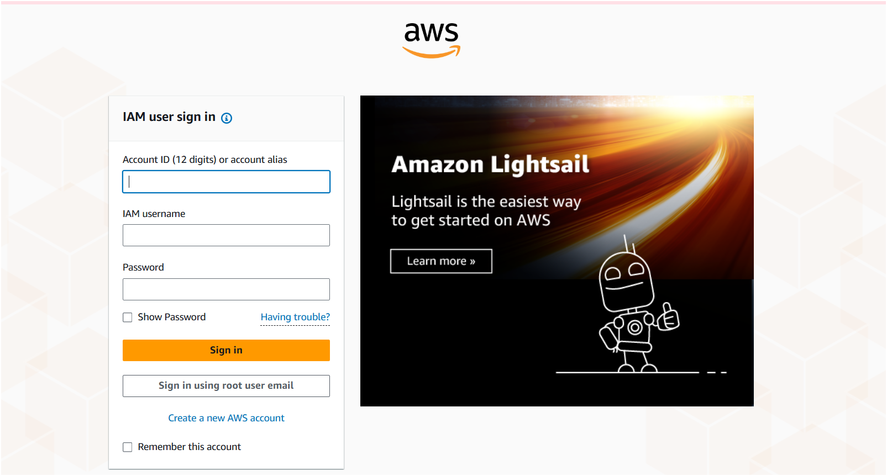

### **Additional Notes:**

- **AWS Free Tier Limits**: Always monitor your usage to avoid unexpected charges.
- **Billing Alerts**: Set up AWS Budgets and alerts to track your spending.
- **Demo Credit or Debit Card**: If you do not want to use your primary card, consider using a virtual or prepaid card that supports online transactions.

By following these steps, you can successfully create your AWS Free Tier account and begin experimenting with AWS cloud services.
