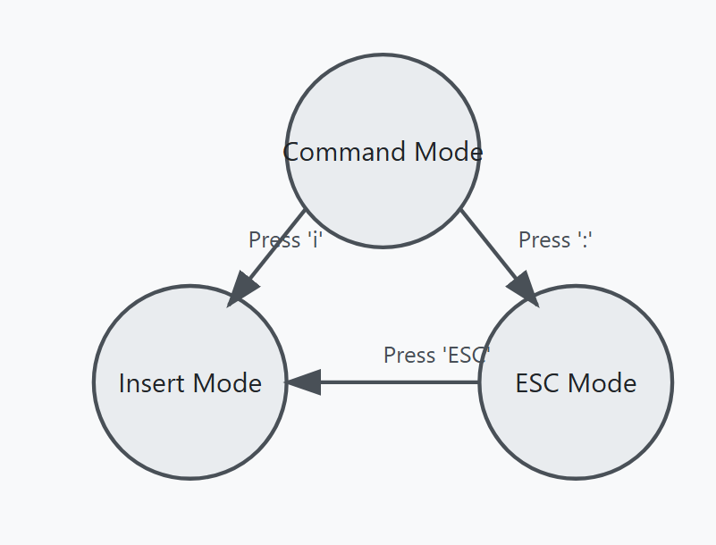

# Linux Class 2 (DevOps & AWS - 08 January 2025)

## File Operations in Linux

### Renaming and Moving Files
```sh
mv <present-name> <new-name>     # Rename a file
mv <present-location filename> <new-location>  # Move a file to a new location
```

### Deleting Files and Directories
```sh
rm <filename>  # Delete a file
rm *.txt       # Delete all files with .txt extension
rm -rf <dir-name>  # Delete directory along with its files
rmdir <dir-name>  # Delete an empty directory
```

## Viewing Command History
```sh
history  # Displays all executed commands
```

## Working with Files Using `cat`

### Creating and Editing Files
```sh
cat > f1.txt  # Create a file and add data (Press Ctrl+D to exit writing mode)
cat >> f1.txt  # Append data to an existing file
```

### Viewing File Contents
```sh
cat f2.txt  # Display the contents of a file
cat -n f1.txt  # Display file contents with line numbers
```

### Reversing File Content
```sh
tac f1.txt  # Display file content in reverse (bottom to top)
rev f1.txt  # Reverse each line and words in that line
```

## Copying Files
```sh
cp f1.txt f2.txt  # Copy f1.txt to f2.txt (Overwrites if f2.txt exists)
```

### Copy Multiple Files to Another File
```sh
cat f1.txt f2.txt > merged.txt  # Combine multiple files into one
```

## Displaying File Contents with `head` and `tail`
```sh
head f1.txt  # Show the first 10 lines of a file (default)
head -n 14 f1.txt  # Show the first 14 lines of a file
head -n 5 f1.txt  # Show the first 5 lines of a file

tail f1.txt  # Show the last 10 lines of a file (default)
tail -n 5 f1.txt  # Show the last 5 lines of a file
```

---

## Searching Text with `grep`
```sh
grep 'aws' f1.txt  # Show lines containing 'aws'
grep -i 'AWS' f1.txt  # Case-insensitive search for 'AWS'
grep -n 'aws' f1.txt  # Show lines with 'aws' and line numbers
grep -v 'aws' f1.txt  # Show lines that do not contain 'aws'
grep 'aws' *  # Search for 'aws' in all files in the current directory
```

## Word Count Commands
```sh
wc f1.txt  # Displays number of lines, words, and characters in a file
```

## Comparing Files
```sh
diff f1.txt f2.txt  # Compare two files and show differences
```

---

## Text Editors in Linux
### `vi` Editor - Default Editor in Linux

### File Creation and Modification
```sh
touch f1.txt  # Creates an empty file
cat > f1.txt  # Create and add content to a file
cp f1.txt f2.txt  # Copy a file
vi f2.txt  # Open a file for editing
```

### Modes in `vi` Editor
1. **Command Mode**
   - Open a file: `vi <filename>`
   - Used for navigation and commands

2. **Insert Mode** (Edit the file)
   - Enter Insert Mode: Press `i`
   - Add or modify text

3. **Escape Mode**
   - Exit Insert Mode: Press `Esc`
   - Save and exit: `:wq`
   - Exit without saving: `:q!`

---

## File Reading Commands
```sh
cat <filename>  # Print file from top to bottom
tac <filename>  # Print file from bottom to top
rev <filename>  # Reverse each line and word
head <filename>  # Print the first 10 lines
tail <filename>  # Print the last 10 lines
vi <filename>  # Open a file
```

---

## `sed` Command (Stream Editor)
- A powerful tool for text manipulation in Linux.
- Used for modifying files without opening them.
- Example usage:
```sh
sed 's/oldtext/newtext/g' file.txt  # Replace 'oldtext' with 'newtext' in a file
```

---

### Diagram: `vi` Editor Workflow
