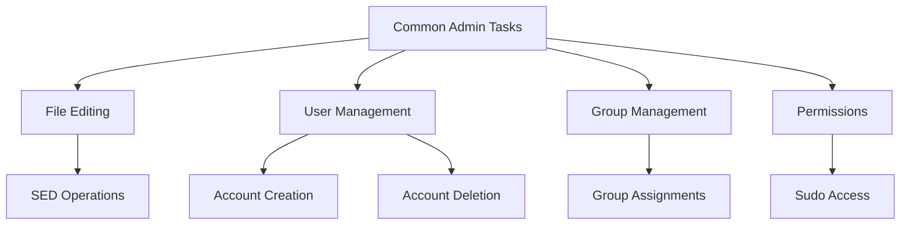
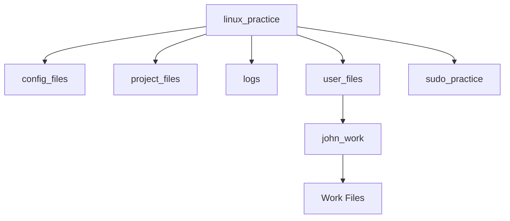

Here are 5 practical scenario-based questions to test understanding of Linux command-line operations:

# Practice Scenarios

## Scenario 1: Text File Management
**Situation**: You're managing a configuration file that contains multiple instances of an old server IP address '192.168.1.100' that needs to be updated to '192.168.1.200'.

**Question**: Which SED command would you use to:
1. Replace only the first occurrence in each line?
2. Replace all occurrences in the file and save changes?

**Solution**:
```bash
# For first occurrence only
sed 's/192.168.1.100/192.168.1.200/' config.txt

# For all occurrences with save
sed -i 's/192.168.1.100/192.168.1.200/g' config.txt
```

## Scenario 2: User Account Setup
**Situation**: You're a system administrator setting up accounts for a new development team of three members: Alice, Bob, and Charlie. They all need to be part of a new group called 'developers'.

**Question**: What sequence of commands would you use to:
1. Create the group
2. Create the user accounts
3. Add them to the developers group
4. Verify their group membership

**Solution**:
```bash
# Create group and users
sudo groupadd developers
sudo useradd alice
sudo useradd bob
sudo useradd charlie

# Add to developers group
sudo usermod -aG developers alice
sudo usermod -aG developers bob
sudo usermod -aG developers charlie

# Verify membership
grep developers /etc/group
```

## Scenario 3: Log File Cleanup
**Situation**: You have a log file (app.log) that contains thousands of lines, and you need to remove all lines containing the word "DEBUG" while preserving other log levels.

**Question**: Which command would you use to:
1. Preview the lines that will be deleted?
2. Actually delete those lines?

**Solution**:
```bash
# Preview DEBUG lines
sed -n '/DEBUG/p' app.log

# Delete DEBUG lines
sed -i '/DEBUG/d' app.log
```

## Scenario 4: User Management
**Situation**: An employee John is leaving the company, but their work files need to be preserved for the next person joining.

**Question**: What commands would you use to:
1. Delete John's user account while preserving their home directory?
2. Change ownership of their files to a new user Sarah?

## Solution Steps

### 1. Backup John's Files
```bash
# Create backup directory
sudo mkdir -p /backup/john_backup
sudo cp -r /home/john/projects/* /backup/john_backup/
```

### 2. Remove John's Account (Preserving Files)
```bash
# Delete account but keep home directory
sudo userdel john
```

### 3. Create Sarah's Account
```bash
# Create new user Sarah
sudo useradd -m sarah
sudo passwd sarah  # Set password for Sarah
```

### 4. Transfer Files and Ownership
```bash
# Create projects directory in Sarah's home
sudo mkdir -p /home/sarah/projects

# Copy files from backup
sudo cp -r /backup/john_backup/* /home/sarah/projects/

# Change ownership of all files to Sarah
sudo chown -R sarah:sarah /home/sarah/projects
```

### 5. Verify Setup
```bash
# Check file ownership
ls -l /home/sarah/projects/

# Verify file contents
cat /home/sarah/projects/project1.txt
cat /home/sarah/projects/project2.txt
cat /home/sarah/projects/important_notes.txt

# Check Sarah's access
sudo -u sarah ls -l /home/sarah/projects/
```

```mermaid
graph TD
    A[User Transition Process] --> B[Backup Files]
    B --> C[Remove Old Account]
    C --> D[Create New Account]
    D --> E[Transfer Files]
    E --> F[Verify Setup]
    B --> G[/backup/john_backup]
    E --> H[/home/sarah/projects]
```

## Verification Checklist
- [ ] All files are successfully copied
- [ ] File permissions are correct
- [ ] Sarah has full access to the files
- [ ] Original content is preserved
- [ ] No broken links or permissions

## Important Notes
1. Always create backups before removing user accounts
2. Verify file permissions after ownership transfer
3. Check for any group-specific permissions that might need to be transferred
4. Document any specific configurations or settings
5. Test the new user's access to all necessary resources


```

## Scenario 5: Sudoers Configuration
**Situation**: You need to give a new DevOps engineer (username: devops) sudo access to only networking commands (ifconfig, netstat, ping).

**Question**: How would you:
1. Open the sudoers file safely?
2. What line would you add to grant this specific access?

**Solution**:
```bash
# Open sudoers file
sudo visudo

# Add the following line
devops ALL=(ALL) /sbin/ifconfig, /bin/netstat, /bin/ping
```



create a test environment to practice these scenarios. Let's set up each scenario step by step.

# Setting Up Practice Environment

## Initial Setup
First, create a dedicated practice directory:

```bash
# Create and enter practice directory
mkdir ~/linux_practice
cd ~/linux_practice
```

## Scenario 1: Text File Management Setup
```bash
# Create a config directory
mkdir config_files
cd config_files

# Create a sample configuration file
cat > server_config.txt << EOF
Server1 IP: 192.168.1.100 
Backup Server: 192.168.1.100
Database: mongodb://192.168.1.100:27017
Redis: 192.168.1.100:6379
Load Balancer: 192.168.1.100:80
EOF

cd ..
```

## Scenario 2: User and Group Management Setup
```bash
# First, create a directory to simulate project files
mkdir project_files
cd project_files

# Create some sample project files
touch project1.txt project2.txt project3.txt

# Add some content to files
echo "This is project 1 content" > project1.txt
echo "This is project 2 content" > project2.txt
echo "This is project 3 content" > project3.txt

cd ..
```

## Scenario 3: Log File Setup
```bash
# Create logs directory
mkdir logs
cd logs

# Create a sample log file with mixed content
cat > app.log << EOF
[2024-02-09 10:00:01] INFO: Application started
[2024-02-09 10:00:02] DEBUG: Initializing database connection
[2024-02-09 10:00:03] ERROR: Failed to connect to backup server
[2024-02-09 10:00:04] DEBUG: Retrying connection...
[2024-02-09 10:00:05] INFO: Connected to primary server
[2024-02-09 10:00:06] DEBUG: Loading user preferences
[2024-02-09 10:00:07] WARNING: High memory usage detected
[2024-02-09 10:00:08] DEBUG: Garbage collection started
[2024-02-09 10:00:09] INFO: System stable
EOF

cd ..
```

## Scenario 4: User Management Practical Exercise

```bash
# Create practice directory
mkdir ~/user_transition
cd ~/user_transition

# Create test files structure for John
sudo useradd john
sudo mkdir -p /home/john/projects
cd /home/john/projects

# Create sample project files
sudo bash -c 'cat > project1.txt << EOF
Project Status: In Progress
Priority: High
Deadline: March 2024
Tasks:
- API Integration
- Database Migration
- Security Updates
EOF'

sudo bash -c 'cat > project2.txt << EOF
Client Requirements:
1. User Authentication
2. Payment Gateway
3. Reporting System
Status: 70% Complete
EOF'

sudo bash -c 'cat > important_notes.txt << EOF
Server Credentials:
- Dev Server: dev.example.com
- Test Environment: test.example.com
- Database Backups: Daily at 2 AM
EOF'

# Set initial ownership
sudo chown -R john:john /home/john/projects
```

## Solution Steps

### 1. Backup John's Files
```bash
# Create backup directory
sudo mkdir -p /backup/john_backup
sudo cp -r /home/john/projects/* /backup/john_backup/
```

### 2. Remove John's Account (Preserving Files)
```bash
# Delete account but keep home directory
sudo userdel john
```

### 3. Create Sarah's Account
```bash
# Create new user Sarah
sudo useradd -m sarah
sudo passwd sarah  # Set password for Sarah
```

### 4. Transfer Files and Ownership
```bash
# Create projects directory in Sarah's home
sudo mkdir -p /home/sarah/projects

# Copy files from backup
sudo cp -r /backup/john_backup/* /home/sarah/projects/

# Change ownership of all files to Sarah
sudo chown -R sarah:sarah /home/sarah/projects
```

### 5. Verify Setup
```bash
# Check file ownership
ls -l /home/sarah/projects/

# Verify file contents
cat /home/sarah/projects/project1.txt
cat /home/sarah/projects/project2.txt
cat /home/sarah/projects/important_notes.txt

# Check Sarah's access
sudo -u sarah ls -l /home/sarah/projects/
```

```mermaid
graph TD
    A[User Transition Process] --> B[Backup Files]
    B --> C[Remove Old Account]
    C --> D[Create New Account]
    D --> E[Transfer Files]
    E --> F[Verify Setup]
    B --> G[/backup/john_backup]
    E --> H[/home/sarah/projects]
```

## Verification Checklist
- [ ] All files are successfully copied
- [ ] File permissions are correct
- [ ] Sarah has full access to the files
- [ ] Original content is preserved
- [ ] No broken links or permissions

## Important Notes
1. Always create backups before removing user accounts
2. Verify file permissions after ownership transfer
3. Check for any group-specific permissions that might need to be transferred
4. Document any specific configurations or settings
5. Test the new user's access to all necessary resources

Would you like me to explain any specific part of this process in more detail?

## Scenario 5: Sudo Practice Setup
```bash
# Create practice sudo directory
mkdir sudo_practice
cd sudo_practice

# Create a mock commands list
cat > allowed_commands.txt << EOF
Available Commands:
/sbin/ifconfig
/bin/netstat
/bin/ping
EOF

cd ..
```

## Directory Structure Check
After setup, verify your structure:
```bash
tree ~/linux_practice
```

You should see:
```
linux_practice/
├── config_files/
│   └── server_config.txt
├── project_files/
│   ├── project1.txt
│   ├── project2.txt
│   └── project3.txt
├── logs/
│   └── app.log
├── user_files/
│   └── john_work/
│       ├── project_notes.txt
│       ├── contacts.txt
│       └── tasks.txt
└── sudo_practice/
    └── allowed_commands.txt
```

## Practice Instructions

### For Scenario 1:
```bash
cd ~/linux_practice/config_files
# Try the sed commands on server_config.txt
```

### For Scenario 2:
```bash
cd ~/linux_practice/project_files
# Practice group and permission commands
```

### For Scenario 3:
```bash
cd ~/linux_practice/logs
# Practice log file manipulation
```

### For Scenario 4:
```bash
cd ~/linux_practice/user_files
# Practice user file management
```

### For Scenario 5:
```bash
cd ~/linux_practice/sudo_practice
# Review allowed commands and practice sudo configurations
```



This setup provides a safe environment to practice all the scenarios. Each directory contains relevant files and content that you can manipulate without affecting your actual system files.

Remember to:
1. Keep regular backups of practice files
2. Use the `-i.bak` flag with sed to create backups before making changes
3. Review file contents before and after commands to understand the changes
